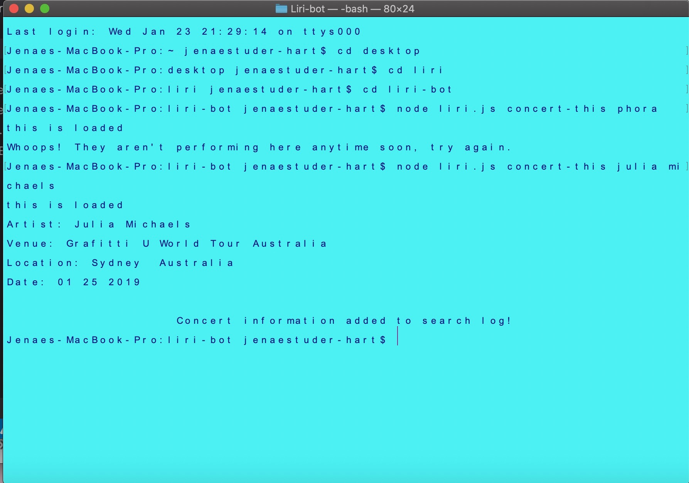
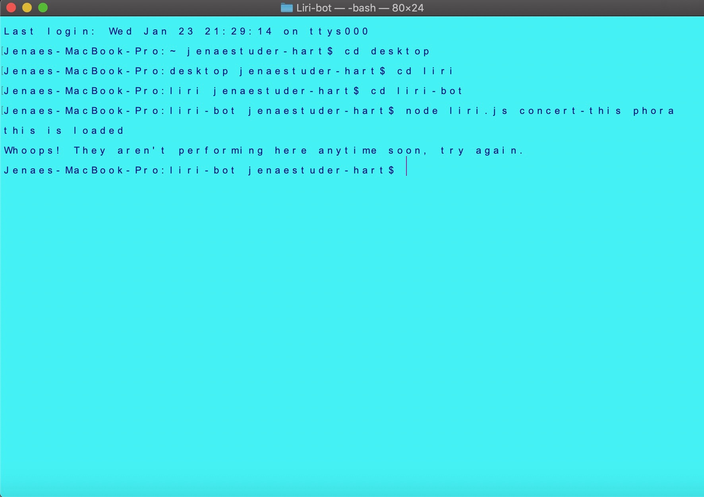
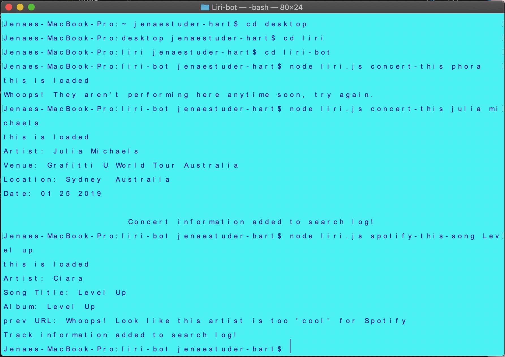

# Liri-bot
# Liri-bot is a node run application that takes in the user value and passes it through multiple API's to retrieve the information.

## When using Liri-bot you can search songs through the Spotify API, movies through the OMDB API and find when and where an artist is performing using the Bands In Town API.

## running this application is simple and requires just a few key words to access all this information. Simply download the repo and follow the file path to where you saved the repo. In the command line get yourself into the file where you stored the repo. From there simply type in "node <filename.js> <command>." as shown below

##Starting LiriBot

##Results

## What is displayed when there aren't any results

##Mulitple searches

